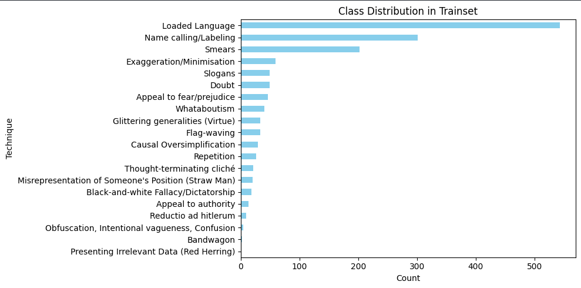
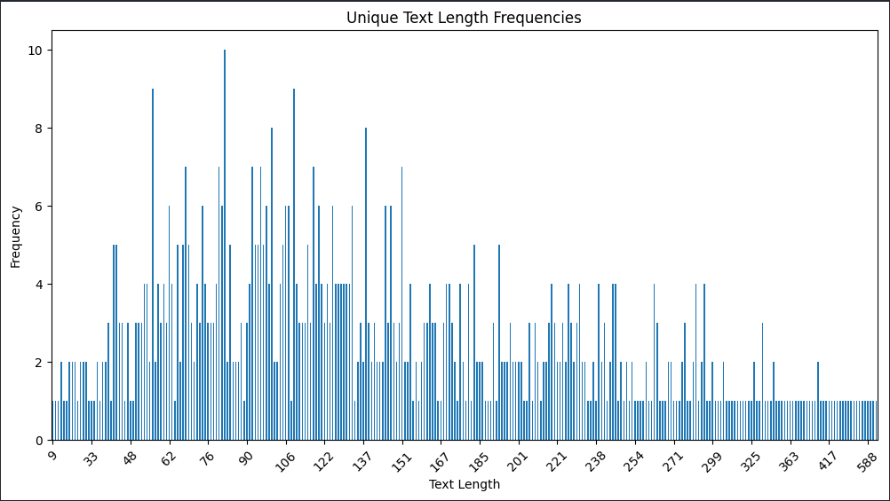
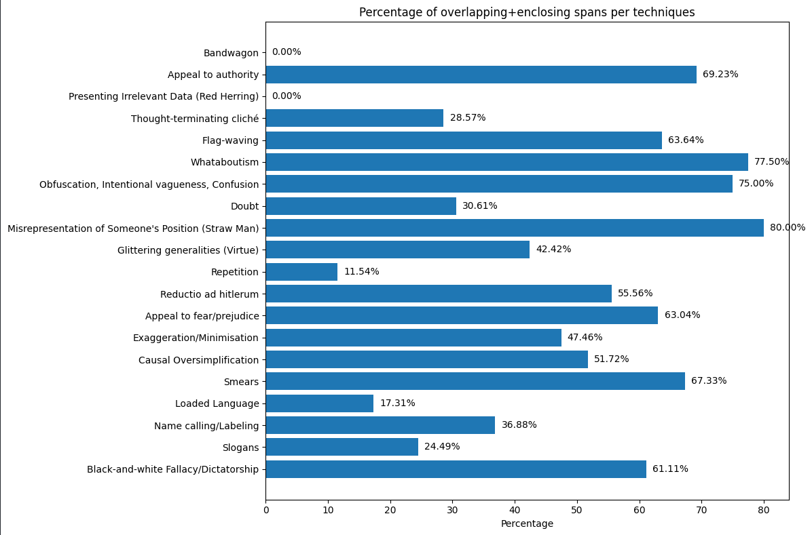

# Exploratory Data Analysis

The objective of the exploratory data analysis (EDA) phase was to understand the structure of the dataset, identify potential modelling challenges, and uncover characteristics that could influence the design of the NLP pipeline.

The dataset consists of internet memes annotated with propaganda techniques. Each observation contains a text sample and a collection of propaganda spans defined using character-level annotations.

---

## Dataset Structure

Each record contains:

* A unique identifier (`id`)
* Meme text (`text`)
* A list of propaganda annotations (`labels`)

Each annotation contains:

* Start character position
* End character position
* Propaganda technique
* Annotated text fragment

### Example Record

```python
{
    "id": "111_batch_2",
    "text": "JOE VERSUS THE VOLCANIC KREMLIN DON...",
    "labels": [
        {
            "start": 16,
            "end": 36,
            "technique": "Name calling/Labeling",
            "text_fragment": "VOLCANIC KREMLIN DON"
        }
    ]
}
```

The annotation format allows multiple propaganda techniques to be assigned to the same meme and, in some cases, the same text fragment.

---

## Dataset Overview

| Dataset     | Total Texts | Empty Spans | Non-Empty Spans |
| ----------- | ----------: | ----------: | --------------: |
| Train       |         688 |         143 |             545 |
| Development |          63 |          15 |              48 |
| Test        |         200 |          41 |             159 |

### Key Findings

* The dataset is relatively small for a deep learning task.
* Most texts contain at least one propaganda annotation.
* A meaningful proportion of texts contain no propaganda spans, requiring the model to distinguish between propaganda and non-propaganda content.
* The dataset combines two tasks:

  * Propaganda span identification
  * Propaganda technique classification

---

## Propaganda Technique Distribution

The training dataset contains:

```text
1498 annotated propaganda spans
```

distributed across 20 propaganda techniques.

### Class Distribution



### Key Findings

* The dataset exhibits significant class imbalance.
* Loaded Language is the dominant technique with 543 occurrences.
* Name calling/Labeling and Smears are the second and third most frequent techniques.
* Several techniques occur fewer than 20 times in the entire training set.
* The rarest technique, Presenting Irrelevant Data (Red Herring), appears only once.

### Implications

This imbalance introduces several modelling challenges:

* Models may become biased towards frequent techniques.
* Minority classes provide very limited training examples.
* Rare techniques may be difficult to learn reliably.
* Evaluation metrics should be interpreted alongside class distributions.

---

## Multi-Label Annotations

During exploration, it was observed that multiple propaganda techniques can be assigned to the same text fragment.

### Example

```text
LORD OF THE LIES
```

Annotated as:

* Loaded Language
* Name calling/Labeling

This indicates that the problem is inherently multi-label rather than strictly multi-class.

### Implications

* A single span may belong to multiple propaganda techniques.
* Annotation overlap must be handled carefully during preprocessing.
* Traditional token-labelling approaches may lose information when overlapping annotations occur.

---

## Text Length Distribution

To better understand the complexity of the dataset, the distribution of text lengths was analysed using character counts.



### Key Findings

* Text lengths vary substantially across the dataset.
* Most memes are relatively short.
* A small number of texts are significantly longer than the majority of samples.
* The longest observed text contains approximately 588 characters.

### Implications

Understanding text length distributions is important for transformer-based models because:

* Sequence length directly impacts computational cost.
* Excessively long texts may require truncation.
* Length distributions help inform maximum sequence length selection during tokenisation.

The analysis indicated that most texts were sufficiently short to be processed without excessive truncation.

---

## Overlapping and Enclosing Span Analysis

One of the most important findings of the exploratory analysis was the prevalence of overlapping and enclosing propaganda annotations.

An overlapping annotation occurs when multiple propaganda techniques share part or all of the same text region.

An enclosing annotation occurs when one propaganda span is fully contained within another span.

### Overlapping and Enclosing Span Distribution



### Key Findings

Several propaganda techniques exhibit extremely high overlap rates:

| Technique                                           | Overlap Rate |
| --------------------------------------------------- | -----------: |
| Misrepresentation of Someone's Position (Straw Man) |        80.0% |
| Whataboutism                                        |        77.5% |
| Obfuscation, Intentional Vagueness, Confusion       |        75.0% |
| Appeal to Authority                                 |        69.2% |
| Smears                                              |        67.3% |
| Flag-waving                                         |        63.6% |
| Appeal to Fear/Prejudice                            |        63.0% |

In contrast:

| Technique       | Overlap Rate |
| --------------- | -----------: |
| Repetition      |        11.5% |
| Loaded Language |        17.3% |
| Slogans         |        24.5% |

appear more frequently as independent spans.

### Implications

This analysis revealed that overlapping annotations are a fundamental characteristic of the dataset rather than a rare edge case.

As a result:

* Multiple techniques frequently occupy the same text region.
* Standard BIO tagging approaches may overwrite existing labels.
* Information can be lost when overlapping spans are forced into a single annotation sequence.

This finding directly motivated the development of the overlap-aware span detection framework proposed later in this project.

---

## Key EDA Findings

The exploratory analysis identified several important dataset characteristics:

* Character-level propaganda annotations require transformation before modelling.
* Significant class imbalance exists across propaganda techniques.
* Multiple techniques can be assigned to the same text fragment.
* Overlapping and enclosing annotations occur frequently.
* The dataset contains both propaganda and non-propaganda examples.
* Text lengths are generally short and suitable for transformer-based modelling.

Most importantly, the discovery of widespread overlapping annotations highlighted a major limitation of traditional BIO tagging approaches and directly informed the design of the novel overlap-aware span detection methodology developed in this project.
